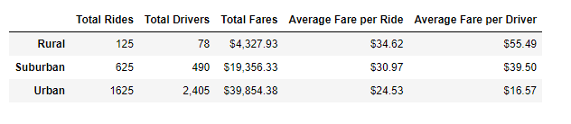
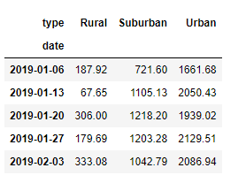
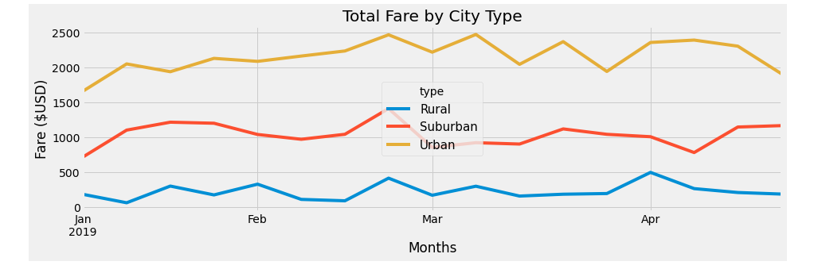

# PyBer_Analysis

## Overview

This analysis used PyBer data to analyze the relationships between 5 key metrics (total rides, total drivers, total fares, average fare per ride and average fare per driver) for 3 types (rural, suburban and urban) of cities. The city_data and ride_data CSV files were read into various dataframes in Jupyter Notebook using the Pandas library and matplotlib.pyplot. 

## Results

The below DataFrame summarizes the different values for these metrics by city type:

1. Urban cities have by far the most total rides at 1625, with suburban at 625 and rural at 125.
2. Urban cities have by far the most total drivers at 2405, with suburban at 490 and rural at 78. 
3. Urban cities have by far the most total fares at $39,854.38, with suburban at $19,356.33 and rural at $4,327.93.
4. The average fare per ride is highest in rural cities at $34.62, followed by suburban at $30.97 and urban at $24.53.
5. The average fare per driver is highest in rural cities at $55.49, followed by suburban at $39.50 and urban at $16.57.

The results for the total fares from each city type for the weeks of 2019-01-06 to 2019-02-03 is summarized in the dataframe below:

Those results displayed as a line graph:

## Sumamry

1. Rural areas have significantly lower total numbers of drivers and rides and have significantly more expensive average ride costs. Increasing the number of drivers available in rural areas could encourage drivers to lower their requested fares.
2. Urban areas by far have the most total rides, drivers and sum of fares. As urban areas have the most demand for rides, redistributing drivers into urban areas could increase their profitability. 
3. Suburban schools do not significantly overperform or underperform in any of these metrics. Collecting deeper information about suburban PyBer users' spending habits would be more helpful to determine how to approach improving usership. 
